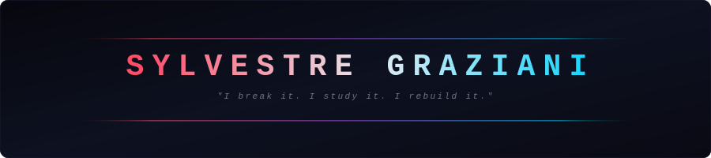
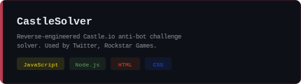
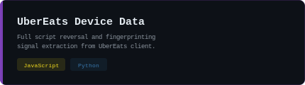
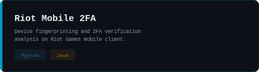
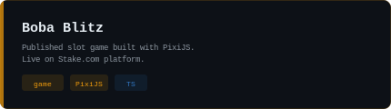
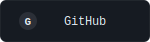
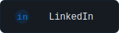
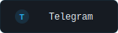
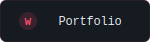

<!-- ═══════════════════ HEADER ═══════════════════ -->

<!-- ═══════════════════ AVATAR + ABOUT ═══════════════════ -->

 

<h3>**`17 y/o CS Student @ Ynov Bordeaux · France`**</h3>

I focus on what runs below the surface — reverse engineering anti-bot systems, analyzing browser fingerprinting, and building tools that go deeper than the docs.

 

 

<!-- ═══════════════════ PROJECTS ═══════════════════ -->

 

 

 

<!-- ═══════════════════ GITHUB STATS ═══════════════════ -->

<a href="https://github.com/Askin242">
  <picture>
    <source media="(prefers-color-scheme: dark)" srcset="https://streak-stats.demolab.com?user=Askin242&hide_border=true&background=0d1117&ring=ff4d6a&fire=ff4d6a&currStreakLabel=00d4ff&sideLabels=8b949e&currStreakNum=e6edf3&sideNums=e6edf3&dates=30363d"/>
    
  </picture>
</a>

 

 

<!-- ═══════════════════ CONNECT ═══════════════════ -->

C O N N E C T

 
Made with &#9829; - Sylvestre

